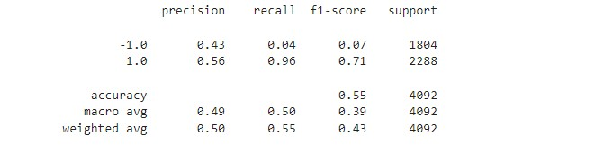

# Module_14_Algorithmic_Trading_ML
The objective of this challenge is to create an algorithmic trading bot that learns and adapts to new data and evolving markets.

---
## Technologies
The programming language used for this analysis was **Python (v 3.9.7)**.

The applicable libraries needed to run this analysis are:

` 1. Path from pathlib 2. pandas 3. numpy 4. sklearn.metrics 5. imblean.metrics 6. sklearn.model_selection 7. sklearn.linear_model 8. tensorflow 9. sklearn.preprocessing 10. hvplot 11. matplotlib.pyplot 12. DateOffset  `

---
## Installation Guide 
Majority of the above libraries should be part of the base applications that were installed with the Python version above; if not, you will have to install them through the pip package manager of Python.

[PIP Install Support Web Site](https://packaging.python.org/en/latest/tutorials/installing-packages/#ensure-you-can-run-python-from-the-command-line)

---
## Contribution

James Handral

James.Handral@gmail.com

---
## License

N/A

---
## Challenge Summary
1. Implement an algorithmic trading strategy that uses machine learning to automate the trade decisions.
2. Adjust the input parameters to optimize the trading algorithm.
3. Train a new machine learning model and compare its performace to that of a baseline model.
4. Create an Evaluation Report that compares the baseline model vs the new model and the tuned trading algorithm (tuned baseline model).

---
## Evaluation Report

* **Baseline Model**:

a) Classification Report

b) Cumulative return plot (actual returns vs the strategy returns)

1. What impact resulted from increasing or decreasing the training window (tuned baseline model)?

Increasing the training window from 3 to 9 months slightly increased the accurracy of the model from 0.55 to 0.56. The recall for the 1.0 predictions increased (0.96 to 0.98) but the recall for the -1.0 predictions decreased (0.04 to 0.02). The precision for the 1.0 predictions stayed the same but increased for -1.0 predictions (0.43 to 0.44).

2. What impact resulted from increasing or decreasing either or both of the SMA windows?

Increasing the short term SMA to 20 from 4 and the long term SMA to 200 from 100 had no change in the model's accuracy compared to the baseline model (.55 vs .55). Overall there were no significant increases in the prediction percentages for the buys and sell for the recall and precision compared against the baseline model.

3. Choose the set of parameters that best improved the trading algorithm returns.

Increasing the Training_end_date to 24 months significantly improved the the predictive percentage of the sells (-1) for the precision (.80 vs .43) and slightly increased the accuracy of the model (.56 vs .55) vs. the baseline model.

4. Evaluate a new ML classifer. Did this new model perform better or worse than the provided baseline model? Did this new model perform better or worse than your tuned trading algorithm?

The new model (using LogisticRegression) performed worse than than both the baseline and tuned trading algorithm models based on the accurracy percentage decreasing to 52% and the cumulative return plot below for the new model.

Conclusion:  Per the 3 Cumulative returns plots shown above the Baseline model's Strategy Returns was more in sync with the the Actual Returns than the other models. Per that assumption I conclude that the Baseline ML model will perform better than the other models in the long run. 

---

 **link to the Jupyter notebook**

 [machine_learning_trading_bot](./Starter_Code%20(14)/Starter_Code/machine_learning_trading_bot.ipynb)

